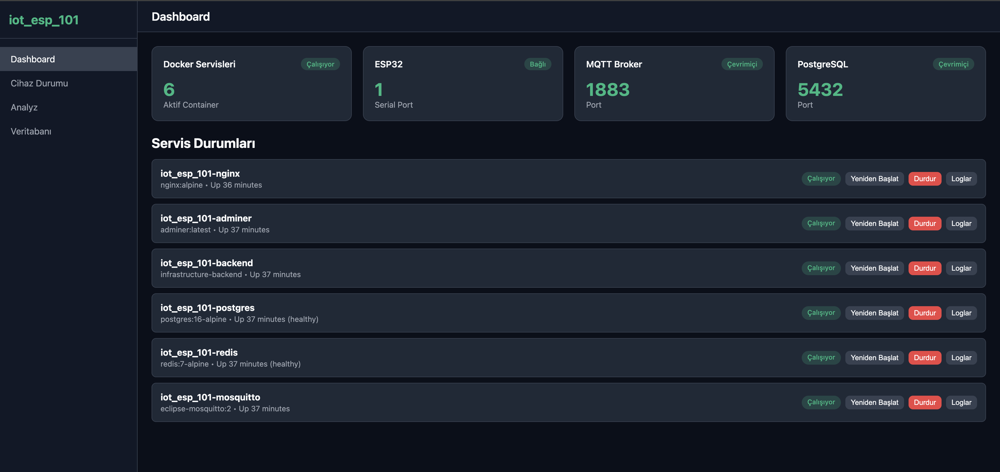
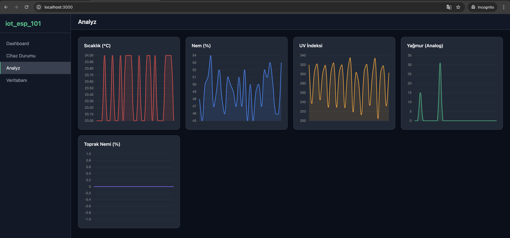
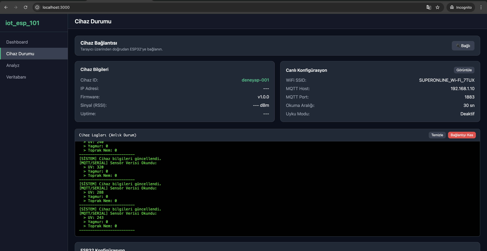
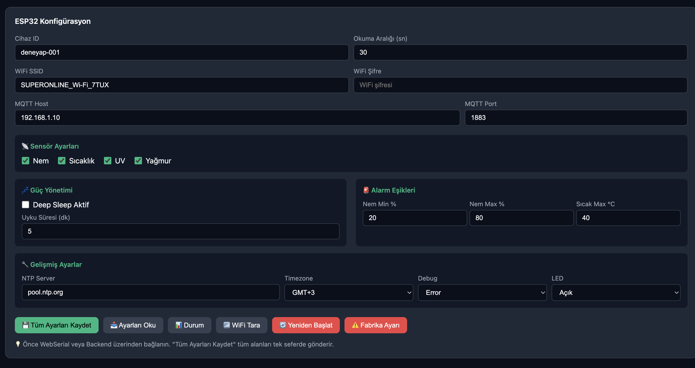
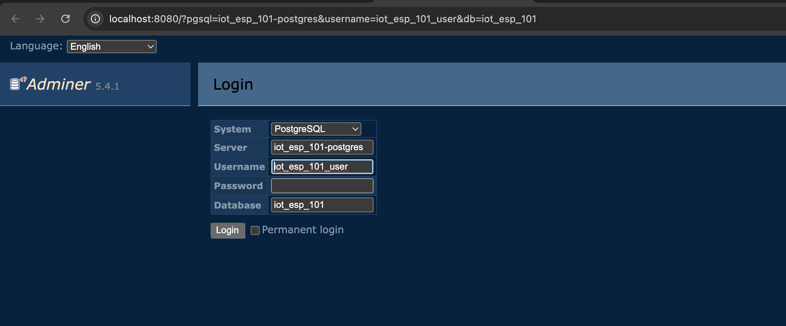

# Espressif - ESP32 - iot_esp_101

Espressif ESP32 ve Deneyap Kart tabanlı cihazlar için kapsamlı bir IoT yönetim ve kontrol paneli. Bu sistem, cihaz konfigürasyonu, gerçek zamanlı sensör izleme ve Docker tabanlı altyapı yönetimi sağlar.

---

### 🖼️ Arayüzden Görünümler

#### 📊 Ana Dashboard


#### 📈 Veri Analizi ve Grafikler


#### 🔋 Cihaz Durumu ve Canlı Veri


#### ⚙️ WebSerial Konfigüratör


#### 🗄️ Veritabanı Yönetimi (Adminer)


---

### 🚀 Altyapı ve Servisler (Yeni Başlayanlar İçin)

Bu proje, bir IoT ekosisteminin giriş düzeyde altyapı katmanlarını içerecek şekilde tasarlanmıştır. İşte kullanılan servislerin rolleri:

- **🌍 Nginx (Frontend)**: Uygulamanın görünen yüzüdür. Tarayıcınızdan girdiğiniz tüm panelleri ve grafikleri size sunar. Bir "Host" görevi görerek tüm isteklerin doğru yere (API veya Adminer) gitmesini sağlar.
- **⚙️ Backend (FastAPI)**: Sistemin beynidir. Docker servislerini yönetir, veritabanı ile konuşur ve MQTT üzerinden gelen karmaşık verileri işleyip frontend'e basitçe sunar.
- **📡 Mosquitto (MQTT Broker)**: Cihazlarla sistem arasındaki "Postane"dir. ESP32 sensör verilerini buraya bırakır, backend ise verileri buradan alır. IoT dünyasının standart iletişim dilidir.
- **🗄️ PostgreSQL (Database)**: Sistemin hafızasıdır. Cihaz bilgilerini, sensörlerin geçmişe dönük verilerini ve analiz sonuçlarını kalıcı olarak saklar.
- **⚡ Redis (Cache)**: Sistemin kısa süreli hafızasıdır. Çok hızlı erişilmesi gereken anlık durum bilgilerini saklayarak sistem performansını artırır.
- **🛠️ Adminer**: Veritabanınızı bir excel tablosu gibi görmenizi sağlayan web arayüzüdür. Teknik detayları kontrol etmek için kullanılır.

---

## 🏗️ Mimari ve Sistem Gereksinimleri

### Donanım Gereksinimleri
- **ESP32 / Deneyap Kart 1A**: Ana mikrodenetleyici.
- **USB Bağlantısı**: İlk kurulum ve firmware yükleme için bilgisayara fiziksel USB bağlantısı gereklidir.
- **Sensörler**: Toprak Nem, Sıcaklık/Nem (DHT), UV Sensörü, Yağmur Sensörü.

### Yazılım Gereksinimleri
- **PlatformIO**: Firmware derleme ve yükleme için VS Code üzerinde PlatformIO eklentisi gereklidir.
- **Docker & Docker Compose**: Arka uç servislerini (PostgreSQL, MQTT, Redis) çalıştırmak için.
- **Mimari**: Bu proje **x86-64 (Intel/AMD)** mimarisine uygun Docker imajları kullanacak şekilde yapılandırılmıştır.

---

## Kurulum Müfredatı

### 1. Hazırlık
- [VS Code](https://code.visualstudio.com/) kurun.
- VS Code içerisinden **PlatformIO IDE** eklentisini yükleyin.
- Bilgisayarınızda **Docker Desktop**'ın kurulu ve çalışır olduğundan emin olun.

### 2. Altyapı Kurulumu (Mac/Linux)
Terminal üzerinden altyapı servislerini başlatın:
```bash
cd infrastructure
docker compose -f docker-compose.local.yml down -v && docker compose -f docker-compose.local.yml up -d --build
```
*(Not: `-v` parametresi veritabanının temizlenmesini sağlar, yeni kurulumlarda önerilir.)*

### 3. ESP32 Firmware Yükleme

Firmware yüklemek için iki yöntem kullanabilirsiniz:

#### A. PlatformIO IDE (Tavsiye Edilen)
- ESP32 kartınızı **USB portu** üzerinden bilgisayarınıza bağlayın.
- VS Code'da `esp32` klasörünü açın.
- PlatformIO araç çubuğunda **Build** (✓) ve ardından **Upload** (→) butonlarına basın.

#### B. PlatformIO CLI (Komut Satırı)
Terminal üzerinden `esp32` dizinine giderek:
```bash
cd esp32

# Derleme (Build)
pio run

# Yükleme (Upload) - Kart USB ile bağlı olmalı
pio run --target upload
```

### 4. Cihaz Konfigürasyonu (USB/WebSerial)

Firmware yüklendikten sonra cihazı en hızlı ve güvenli şekilde Dashboard üzerinden yapılandırabilirsiniz:

1. **Altyapıyı Başlatın**: `infrastructure` klasöründe Docker servislerinin çalıştığından emin olun.
2. **Dashboard'a Erişin**: Tarayıcınızdan (Chrome/Edge) [http://localhost:3000](http://localhost:3000) adresine gidin.
3. **ESP32 Terminal'e Geçin**: Yan menüden "ESP32 Terminal" sekmesini seçin.
4. **Cihaza Bağlanın**: 
   - ESP32'nin USB ile bağlı olduğundan emin olun.
   - "WebSerial ile Bağlan" butonuna tıklayıp listeden kartınızı seçin.
5. **Ayarları Kaydedin**: 
   - Ekrandaki konfigürasyon panelinden WiFi, MQTT ve sensör ayarlarını yapın.
   - **"Tüm Ayarları Kaydet"** butonuna basarak ayarları kalıcı olarak ESP32'ye gönderin.
6. **İzlemeye Başlayın**: Ayarlar kaydedildikten sonra cihaz otomatik olarak MQTT sunucusuna bağlanacak ve "Cihazlar" sayfasında canlı sensör verileri belirecektir.

> **💡 Alternatif Yöntem**: Cihaz USB ile bağlı değilse, **"espressif - esp32 - deneyapkart"** (şifre: `deneyapkart`) WiFi ağına bağlanarak açılan portal üzerinden de kurulum yapabilirsiniz.

---

## ⌨️ Seri Port Komutları (WebSerial Terminal)

Web-tabanlı terminal üzerinden şu komutları kullanabilirsiniz:
- `STATUS`: Cihazın genel durumunu gösterir.
- `GET_CONFIG`: Tüm ayarları JSON formatında getirir.
- `SET_DEVICE_ID:isim`: Cihaz kimliğini belirler.
- `SET_READ_INTERVAL:sn`: Sensör okuma aralığı (5-3600 sn).
- `SET_SENSORS:n,s,u,y`: Sensörleri aktif/pasif yapar (1/0).
- `SET_SLEEP:aktif,dk`: Derin uyku modunu yapılandırır.
- `SET_NTP:server,gmt`: Saat senkronizasyonu ayarı.
- `RESTART`: Cihazı yeniden başlatır.

---

## 📁 Proje Yapısı

```
iot-t1/
├── esp32/                    # ESP32 Firmware (PlatformIO)
├── infrastructure/           # Docker & Deployment (Altyapı)
├── backend/                  # Python FastAPI (API & MQTT Manager)
└── frontend/                 # Web Dashboard (Yönetim Paneli)
```

## 📊 Önemli Bağlantılar
- 🖥️ **Yönetim Paneli**: [http://localhost:3000](http://localhost:3000)
- 📡 **API Dokümantasyonu**: [http://localhost:8000/docs](http://localhost:8000/docs)
- 🗄️ **Veritabanı (Adminer)**: [http://localhost:8080](http://localhost:8080)

---

### ✨ Geliştirme Notu
Bu uygulama, yapay zeka destekli yazılım geliştirme asistanı olan **Antigravity** ile modernize edilmiş ve geliştirilmiştir. 🦾⚡

> **Not:** Bu proje eğitim ve geliştirme amaçlıdır. Prodüksiyon ortamında MQTT ve DB şifrelerini değiştirmeniz önerilir.
